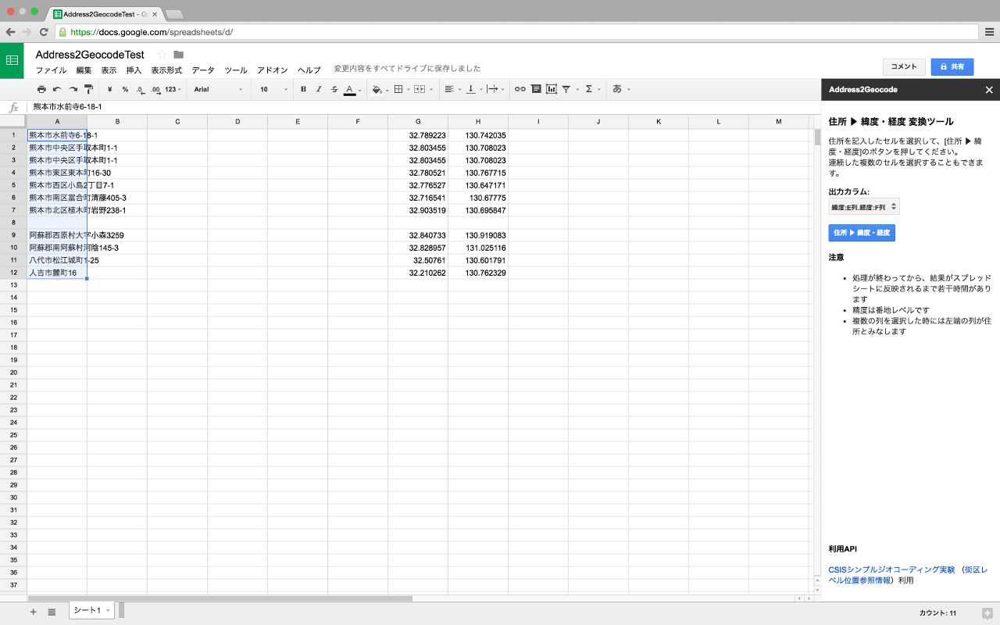

# Address2Geocode

日本の住所から緯度経度を求めるためのGoogle Spreadsheet用アドオンです。
住所を記入したセル/カラムを選択して、その緯度経度を指定したカラムに書き込むことができます。

## インストール

1. 次のリンクをクリックします。
 - [Address2Geocode](https://chrome.google.com/webstore/detail/address2geocode/nmaiahekllnmbebbkhliegobooddaloj?utm_source=permalink)
2. 右上の「＋無料」ボタンをクリックしてインストールします。
3. 任意のスプレッドシートで使えるようになっています。

## 使い方
1. 「アドオン」メニューに「Address2Geocode」というメニューができているので「サイドバーを開く」を選択します。
2. サイドバーが表示されるので「出力カラム」で緯度経度を出力するカラムを選択します。
3. 住所を記入したセルを選択して「住所▶緯度・経度」ボタンをクリックします。
4. しばらくして「処理を終了しました」とうダイアログが表示されるので **OK** ボタンをクリックして閉じると出力カラムに緯度・経度が入力されます。

### 注意
- インストール時に権限許可を求められます。ご利用の場合、許可してください。
- 日本語で表記された日本の住所のみ変換します。(This add-on only support Japanese characters and locations.)
- ネットワークに接続していない状態では利用できません。
- 出力カラムのセルにすでに値が入っている場合、上書きせず、その行はスキップします。出力カラムの値を削除して再度実行してください。

## 利用API
このアドオンは緯度経度への変換は次のWebAPIを利用しています。
- [CSISシンプルジオコーディング実験](http://newspat.csis.u-tokyo.ac.jp/geocode/modules/geocode/index.php?content_id=1) ([街区レベル位置参照情報](http://nlftp.mlit.go.jp/isj/)) API
