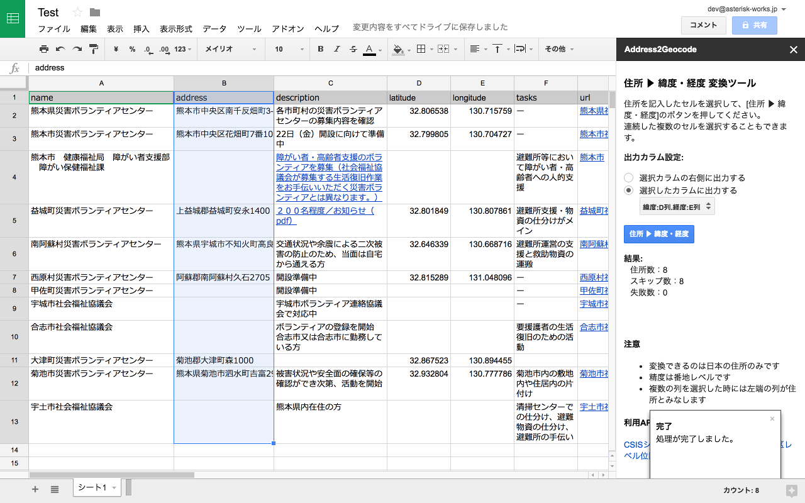

# Address2Geocode

日本の住所から緯度経度を求めるためのGoogle Spreadsheet用アドオンです。
住所を記入したセルを選択して、その緯度経度を指定したカラムに書き込むことができます。

## インストール

### Chrome ウェブストアからインストール

- 現在審査待ちです。以下の手順は審査後使えると思います。
  それまではスクリプトをコピーする方法でインストールしてください。

1. 「アドオン」メニューの「アドオンを取得する」を選択します
2. アドオンポップアップが開くので「Address2Geocode」で検索します
3. 検索結果から Address2Geocode を選択します。
4. 右上の「＋無料」ボタンをクリッしてインストールします。

### スクリプトをコピーしてインストール

1. このアドオンを使いたいスプレッドシートを開きます
2. 「ツール」メニューの「スクリプトエディタ...」を選択します
3. 「コード.gs」というファイルが開いているので、一旦中身を削除します。
4. スクリプトエディタ上の **コード.gs** にこのリポジトリの **code.js** のコードをすべてコピーします。
5. スクリプトエディタ上で「ファイル」-「新規作成」-「HTMLファイル」を選択して **sidebar.html** という名前でHTMLファイルを作成します。
6. **sidebar.html** の中身を一旦すべて削除し、リポジトリの **sidebar.html** の中身をすべてコピーします。
7. スクリプトエディタ上で編集したファイルを保存します。
 - この時、プロジェクト名を保存するダイアログが表示されるが「Address2Geocode」と入力します。
8. スクリプトエディタのタブを閉じ、元のスプレッドシートのタブをリロードします。

※この方法でインストールした場合、そのスプレッドシートでしか使えません。

## 使い方
1. 「アドオン」メニューに「Address2Geocode」というメニューができているので「サイドバーを開く」を選択します。
2. サイドバーが表示されるので「出力カラム」で緯度経度を出力するカラムを選択します。
3. 住所を記入したセルを選択して「住所▶緯度・経度」ボタンをクリックします。
4. しばらくして「処理を終了しました」とうダイアログが表示されるので **OK** ボタンをクリックして閉じると出力カラムに緯度・経度が入力されます。

### 注意
- 最初の利用時に権限許可を求められます。ご利用の場合、許可してください。
- 内部でWebAPIを利用しているのでネットワークに接続していない状態では利用できません。
- 出力カラムのセルにすでに値が入っている場合、上書きせず、その行はスキップします。出力カラムの値を削除して再度実行してください。
- 処理が終了してから緯度・経度が表示されるまで少し時間がある場合があります。

## 利用API
このアドオンは緯度経度への変換は次のWebAPIを利用しています。
- [CSISシンプルジオコーディング実験](http://newspat.csis.u-tokyo.ac.jp/geocode/modules/geocode/index.php?content_id=1) ([街区レベル位置参照情報](http://nlftp.mlit.go.jp/isj/)) API
